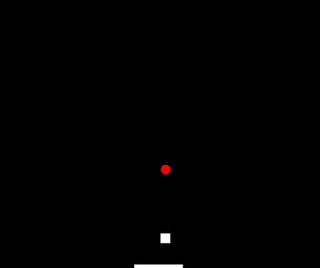
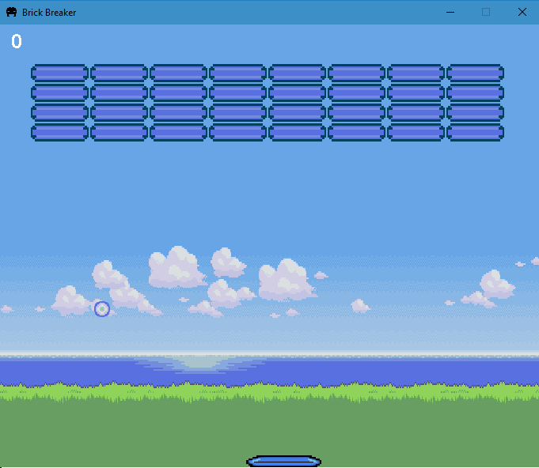

# Brick Breaker

### First stage

- Added 
    - Pallet
    - Ball
- Movement
    - Ball direction change on meeting edges
    - Player movement on x axis
    - Ball and player's pallet interaction
 

### Second stage
- Added 
    - Bricks
    - Score system
    - Fail / Win conditions and display messages
- Movement
    - Ball direction change on meeting bricks
- Interface 
    - Created pallet, ball and brick interface using Photoshop
    - Added a pixel art background
    - Added Icon
    

